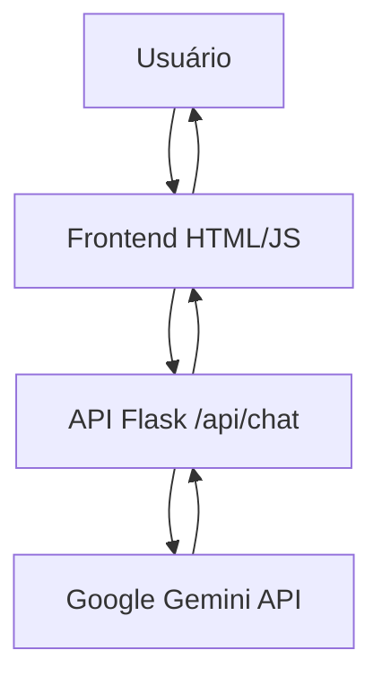

# 🤖 Chatbot de Atendimento Flask

Um chatbot inteligente desenvolvido em Flask com integração à API Google Gemini para atendimento automatizado personalizado.

## 📋 Índice

- [Visão Geral](#-visão-geral)
- [Funcionalidades](#-funcionalidades)
- [Tecnologias Utilizadas](#-tecnologias-utilizadas)
- [Estrutura do Projeto](#-estrutura-do-projeto)
- [Instalação e Configuração](#-instalação-e-configuração)
- [Como Usar](#-como-usar)
- [Arquitetura da Aplicação](#-arquitetura-da-aplicação)
- [Endpoints da API](#-endpoints-da-api)
- [Personalização](#-personalização)
- [Troubleshooting](#-troubleshooting)
- [Contribuição](#-contribuição)

## 🎯 Visão Geral

Este projeto é um chatbot de atendimento ao cliente que utiliza inteligência artificial (Google Gemini) para fornecer respostas personalizadas baseadas nas configurações da empresa. A aplicação combina um backend Flask com uma interface web moderna e responsiva.

### Características Principais:

- ✅ Chat em tempo real
- ✅ Integração com Google Gemini AI
- ✅ Interface responsiva e moderna
- ✅ Personalização por empresa
- ✅ Botões de resposta rápida
- ✅ Integração com Google Calendar
- ✅ Links para WhatsApp, email e redes sociais
- ✅ Tratamento robusto de erros

## 🚀 Funcionalidades

### Backend (Flask)

- **API RESTful** para comunicação com o frontend
- **Integração com Google Gemini** para respostas inteligentes
- **Sistema de prompts personalizados** baseado na empresa
- **Base de conhecimento** adaptável por tipo de negócio
- **Logs detalhados** para monitoramento
- **Endpoints de saúde** para verificação de status

### Frontend (HTML/CSS/JavaScript)

- **Interface de chat moderna** com Tailwind CSS
- **Animações suaves** e indicador de "digitando..."
- **Botões de resposta rápida** para perguntas comuns
- **Design responsivo** para mobile e desktop
- **Integração com Google Calendar** para agendamentos
- **Links diretos** para WhatsApp, email e Instagram

## 🛠 Tecnologias Utilizadas

### Backend

- **Python 3.x**
- **Flask** - Framework web
- **Flask-CORS** - Cross-Origin Resource Sharing
- **Requests** - Cliente HTTP para APIs
- **python-dotenv** - Gerenciamento de variáveis de ambiente

### Frontend

- **HTML5** - Estrutura da página
- **CSS3** - Estilização personalizada
- **JavaScript (ES6+)** - Lógica do frontend
- **Tailwind CSS** - Framework CSS utilitário
- **AOS** - Animações de scroll
- **Feather Icons** - Biblioteca de ícones

### Integrações Externas

- **Google Gemini API** - Inteligência artificial
- **Google Calendar** - Agendamento de compromissos
- **WhatsApp API** - Link direto para contato

## 📁 Estrutura do Projeto

```
projetoflask/
├── app.py                 # Servidor Flask principal
├── index.html             # Interface do usuário
├── .env                   # Variáveis de ambiente (chave API)
├── .venv/                 # Ambiente virtual Python
├── requeriments.txt       # Dependências do projeto
├── README.md              # Documentação
└── static/                # Arquivos estáticos
    ├── style.css          # Estilos personalizados
    ├── scrypt.js          # JavaScript do frontend
    └── favicon.ico        # Ícone do site
```

## ⚙️ Instalação e Configuração

### Pré-requisitos

- Python 3.7 ou superior
- Chave da API Google Gemini
- Navegador web moderno

### 1. Clone o Repositório

```bash
git clone <url-do-repositorio>
cd projetoflask
```

### 2. Crie o Ambiente Virtual

```bash
python -m venv .venv
```

### 3. Ative o Ambiente Virtual

**Windows:**

```bash
.venv\Scripts\activate
```

**Linux/macOS:**

```bash
source .venv/bin/activate
```

### 4. Instale as Dependências

```bash
pip install flask flask-cors requests python-dotenv
```

### 5. Configure a Chave da API

Crie um arquivo `.env` na raiz do projeto:

```bash
echo GEMINI_API_KEY=sua_chave_da_api_gemini_aqui > .env
```

**Como obter a chave da API Gemini:**

1. Acesse [Google AI Studio](https://makersuite.google.com/app/apikey)
2. Faça login com sua conta Google
3. Clique em "Create API Key"
4. Copie a chave gerada

### 6. Execute a Aplicação

```bash
python app.py
```

### 7. Acesse a Aplicação

Abra seu navegador e acesse: `http://localhost:5000`

## 🎮 Como Usar

### Iniciando o Chatbot

1. Execute `python app.py` no terminal
2. Acesse `http://localhost:5000` no navegador
3. Digite sua mensagem no campo de texto
4. Pressione Enter ou clique no botão enviar

### Botões de Resposta Rápida

- **Status do pedido** - Consulta sobre pedidos
- **Problemas com login** - Suporte para acesso
- **Informações de entrega** - Dados sobre entregas
- **Falar com atendente** - Transferência para humano

### Funcionalidades Especiais

- **Agendamento**: Clique no botão "Agendar um compromisso"
- **WhatsApp**: Link direto para contato via WhatsApp
- **Email**: Link direto para envio de email
- **Instagram**: Link para perfil no Instagram

## 🏗 Arquitetura da Aplicação

### Fluxo de Comunicação



### Componentes Principais

#### Backend (app.py)

- **Configuração da Empresa**: Personalização do chatbot
- **Base de Conhecimento**: Especialidades por tipo de negócio
- **Sistema de Prompts**: Construção de prompts personalizados
- **Integração Gemini**: Comunicação com IA
- **Tratamento de Erros**: Fallbacks e mensagens amigáveis

#### Frontend (index.html + static/)

- **Interface de Chat**: Área de mensagens responsiva
- **Controles de Entrada**: Campo de texto e botões
- **Indicador de Digitação**: Feedback visual durante processamento
- **Integrações Sociais**: Links para WhatsApp, email, Instagram

## 📡 Endpoints da API

### `GET /`

**Descrição**: Serve a página principal do chatbot
**Resposta**: Arquivo HTML da interface

### `POST /api/chat`

**Descrição**: Endpoint principal para comunicação com o chatbot
**Corpo da Requisição**:

```json
{
  "message": "Sua mensagem aqui",
  "timestamp": "2024-01-01T12:00:00.000Z"
}
```

**Resposta**:

```json
{
  "response": "Resposta do chatbot"
}
```

### `GET /api/health`

**Descrição**: Verifica se a API está funcionando
**Resposta**:

```json
{
  "status": "ok",
  "company": "Nome da Empresa",
  "timestamp": "2024-01-01T12:00:00.000Z"
}
```

### `GET /api/config`

**Descrição**: Retorna configurações públicas da empresa
**Resposta**:

```json
{
  "company_name": "Nome da Empresa",
  "business_type": "Tipo de Negócio",
  "work_hours": "Horário de Funcionamento",
  "contact_phone": "Telefone de Contato"
}
```

## 🎨 Personalização

### Configuração da Empresa

Edite o dicionário `COMPANY_CONFIG` em `app.py`:

```python
COMPANY_CONFIG = {
    'company_name': 'Sua Empresa',
    'business_type': 'Descrição do seu negócio',
    'custom_instructions': '''
    - Instruções específicas para o chatbot
    - Como deve se comportar
    - Informações importantes
    ''',
    'work_hours': 'Segunda a Sexta, 8h às 18h',
    'contact_phone': '(XX) 99999-9999',
    'contact_email': 'contato@empresa.com',
    'website': 'www.empresa.com',
}
```

### Base de Conhecimento

Personalize o dicionário `BUSINESS_KNOWLEDGE` para diferentes tipos de negócio:

```python
BUSINESS_KNOWLEDGE = {
    'ecommerce': {
        'specialty': 'vendas online, pedidos, entregas',
        'common_topics': ['pedido', 'entrega', 'produto'],
        'greeting_style': 'Sou especializado em e-commerce!'
    },
    # Adicione outros tipos de negócio...
}
```

### Interface

- **Cores**: Modifique as classes CSS em `static/style.css`
- **Texto**: Edite o conteúdo HTML em `index.html`
- **Funcionalidades**: Adicione novos botões ou links conforme necessário

## 🔧 Troubleshooting

### Problemas Comuns

#### 1. "ModuleNotFoundError: No module named 'flask'"

**Solução**: Certifique-se de que o ambiente virtual está ativado:

```bash
.venv\Scripts\activate  # Windows
pip install flask flask-cors requests python-dotenv
```

#### 2. "API Gemini retornou status 400"

**Solução**: Verifique se a chave da API está correta no arquivo `.env`

#### 3. Chatbot não responde

**Solução**:

- Verifique a conexão com a internet
- Confirme se a API Gemini está funcionando
- Verifique os logs no terminal

#### 4. Erro de CORS

**Solução**: O Flask-CORS já está configurado, mas se houver problemas:

```python
from flask_cors import CORS
CORS(app, origins=['*'])  # Para desenvolvimento
```

### Logs e Debug

- **Logs do Servidor**: Aparecem no terminal onde o Flask está rodando
- **Logs do Browser**: Abra o DevTools (F12) e vá para a aba Console
- **Modo Debug**: Está ativado por padrão (`debug=True`)

## 📝 Logs de Exemplo

### Terminal (Backend)

```
[2024-01-01 12:00:00] User: Como posso rastrear meu pedido?
[2024-01-01 12:00:01] Bot: Para rastrear seu pedido, você pode...
```

### Browser (Frontend)

```
Erro ao comunicar com o servidor: TypeError: Failed to fetch
```

## 🚀 Deploy em Produção

### Configurações para Produção

1. **Desative o modo debug**:

```python
app.run(debug=False, host='0.0.0.0', port=5000)
```

2. **Use um servidor WSGI** (recomendado):

```bash
pip install gunicorn
gunicorn -w 4 -b 0.0.0.0:5000 app:app
```

3. **Configure variáveis de ambiente**:

```bash
export GEMINI_API_KEY=sua_chave_aqui
```

### Opções de Deploy

- **Heroku**: Deploy simples com Git
- **DigitalOcean**: Droplet com Ubuntu
- **AWS EC2**: Instância EC2 com Linux
- **Vercel**: Deploy de aplicações Python
- **Railway**: Deploy automático com Git

## 🤝 Contribuição

### Como Contribuir

1. Fork o projeto
2. Crie uma branch para sua feature (`git checkout -b feature/AmazingFeature`)
3. Commit suas mudanças (`git commit -m 'Add some AmazingFeature'`)
4. Push para a branch (`git push origin feature/AmazingFeature`)
5. Abra um Pull Request

### Melhorias Sugeridas

- [ ] Sistema de autenticação de usuários
- [ ] Banco de dados para histórico de conversas
- [ ] Integração com mais APIs de IA
- [ ] Dashboard administrativo
- [ ] Sistema de analytics
- [ ] Suporte a múltiplos idiomas
- [ ] Chat em grupo
- [ ] Upload de arquivos

## 📄 Licença

Este projeto está sob a licença MIT. Veja o arquivo `LICENSE` para mais detalhes.

## 👨‍💻 Autor

**Marcelo** - Estudante Desenvolvimento de Sistemas

- GitHub: [@marckcm](https://github.com/marckcm)
- Email: marckcmdesigner@gmail.com

**Marcos** - Estudante Desenvolvimento de Sistemas

- GitHub: [@marckcm](https://github.com/marckcm)
- Email: marckcmdesigner@gmail.com

**Gabriel** - Estudante Desenvolvimento de Sistemas

- GitHub: [@marckcm](https://github.com/marckcm)
- Email: marckcmdesigner@gmail.com

**Rafael Rodrigues** - Estudante Desenvolvimento de Sistemas

- GitHub: [@marckcm](https://github.com/marckcm)
- Email: marckcmdesigner@gmail.com

## 🙏 Agradecimentos

- [Google Gemini](https://ai.google.dev/) - API de inteligência artificial
- [Flask](https://flask.palletsprojects.com/) - Framework web Python
- [Tailwind CSS](https://tailwindcss.com/) - Framework CSS
- [Feather Icons](https://feathericons.com/) - Biblioteca de ícones

---

**⭐ Se este projeto foi útil para você, considere dar uma estrela no repositório!**
